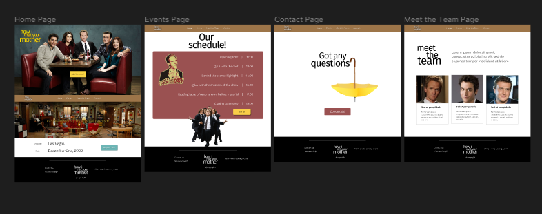
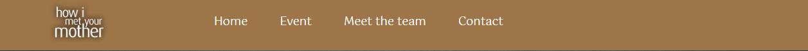
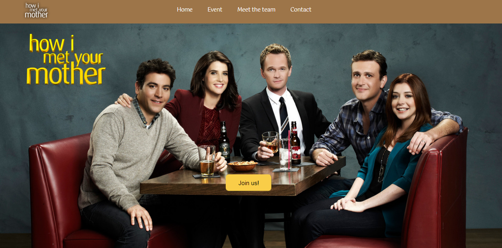
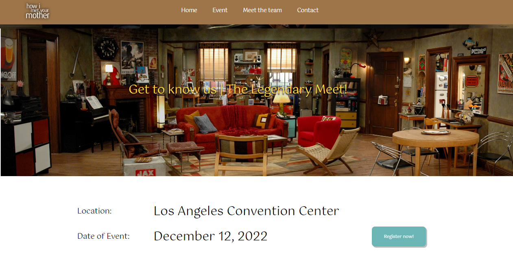
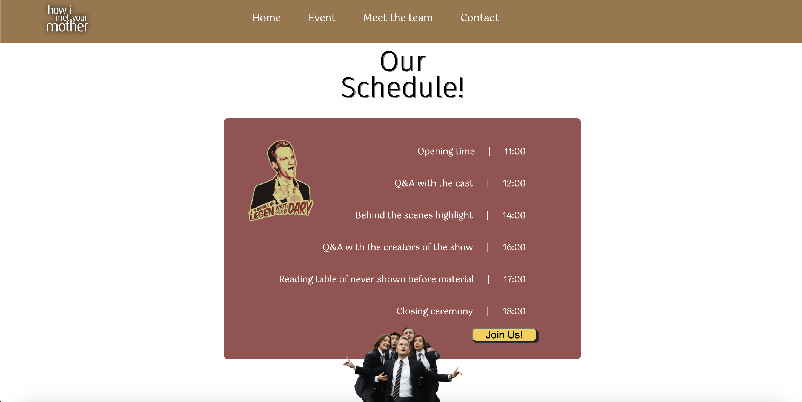
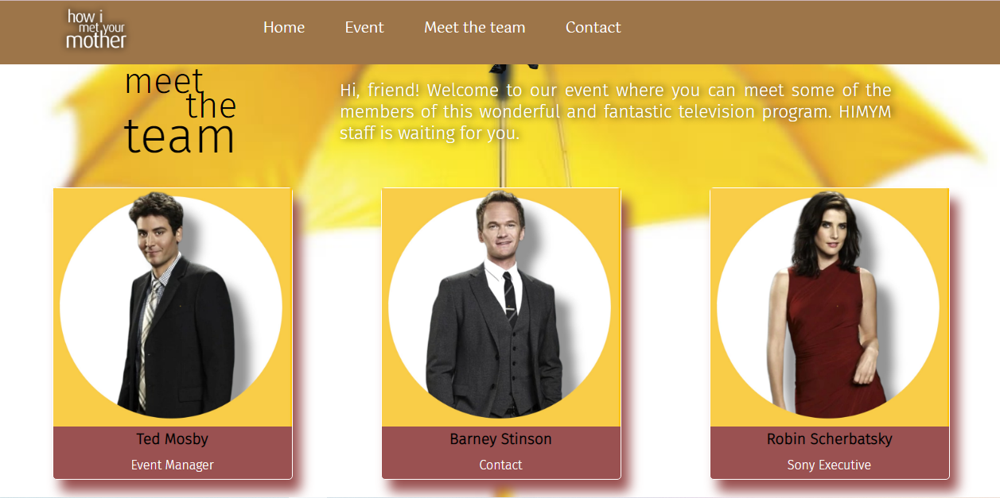
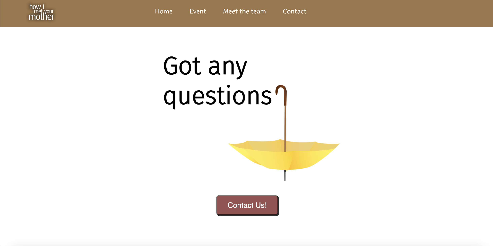

# HIMYM
ITK Project (Team 3), How I Met Your Mother Website

## Project Information

### Customer
- Carlos Reyes

### Website Name
The Legendary Event

### Development & Design Team
- Dannaé Díaz
- Karla Chablé
- Nathaly Marrufo 

### About the file:
The purpose of this file is to provide overview, setup instructions and background information of the project. If you have joined this project as a part of the development team, please ensure this file is up to date.

Note : Any dependencies added / modified to this project which affect the running of the code in this git repository must be listed in this file. All developers must ensure that the instructions mentioned in this file are sufficient to enable a new developer to obtain a executable copy of the lastest code in this repository, without involvement from any other human assistance.

### Fetching git code to local system

Open a code editor like VS Code and launch a terminal.
Clone the repository from GitHub :
```
$ git clone git@github.com:ClaudiaDiaz-Ksquare/HIMYM.git
```

Change current working directory to Project directory:
```
$ cd HIMYM
```

Check the latest development branch. As of writing this guide, the main branch used for development is "Develop".
To switch to this branch:
```
$ git checkout Develop
```

To create your own branch from develop:
```
git checkout -b branch_name origin/Develop
```

Make sure your new branch is up to date:
```
git pull origin Develop
```

Now you can start working on the project!

## Technical Documentation

### Requirements:
Wifi connection.
Device with web browser:
- Computer with Mac, Windows or Linux OS. 
- Tablet IOS (^9) or Android (^4) system.  
- Smartphone IOS (^9) or Android (^4) system.

### Link to website: 
https://claudiadiaz-ksquare.github.io/HIMYM/

### Technologies:
- HTML
- CSS
- JS

### UI Design:
- https://www.figma.com/file/PAvF8OD8qCzWFfVNVXJQqT/HIMYM?node-id=3%3A12&t=pLFFCpuPa3EnukZs-0



### Elements & Screenshots:
#### Navbar
You can click the navbar elements (i.e. Home) to be redirected to its corresponding part of the website.


#### Home



#### Events


#### Meet the team


#### Contact
A typeform will open when you click the "Contact Us" button.


#### Footer & sound
The HIMYM music theme will automatically start playing when the website loads. The music control located at the footer can alter playing the sound.


